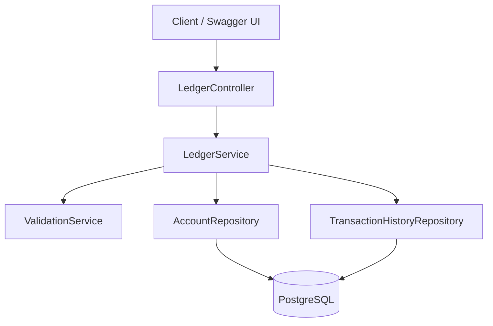
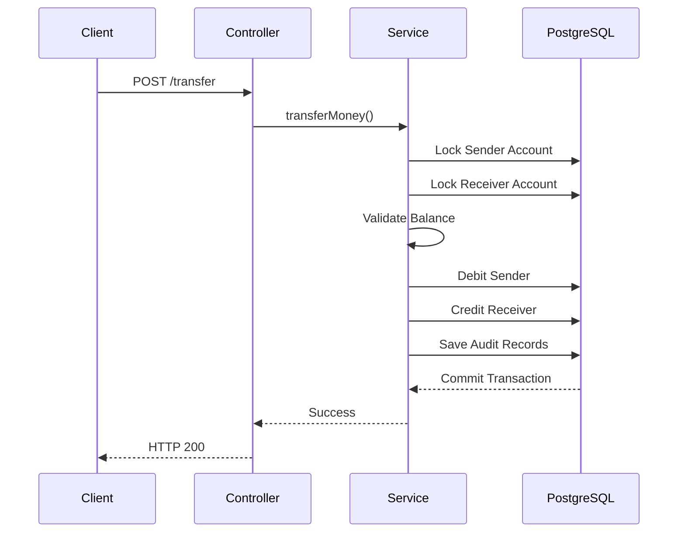

# Atomix — Transaction Ledger System

---

## 📌 Overview

Atomix is a production-inspired backend ledger engine built using **Java 21**, **Spring Boot**, and **PostgreSQL** to simulate secure financial transaction processing.

The project implements **double-entry accounting**, **ACID-compliant fund transfers**, **pessimistic database locking**, and **RESTful APIs** while maintaining an immutable audit trail for every transaction.

Unlike a traditional CRUD application, Atomix focuses on backend engineering concepts such as transactional consistency, concurrency control, layered architecture, and clean API design.

---

## ✨ Features

* **Double-Entry Ledger** – Automatically creates corresponding debit and credit records for every successful transfer.
* **Thread-Safe Money Transfers** – Uses PostgreSQL Pessimistic Write Locking to prevent race conditions during concurrent updates.
* **ACID Transactions** – Guarantees atomic fund transfers using Spring's `@Transactional`.
* **Immutable Audit Trail** – Every transfer is permanently recorded in the transaction history.
* **DTO-based REST APIs** – Prevents exposing internal JPA entities directly to API consumers.
* **Centralized Exception Handling** – Provides consistent API responses using custom exceptions and global exception mapping.
* **Request Validation** – Validates incoming requests before business logic execution.
* **Pagination & Filtering** – Supports paginated and filtered transaction history retrieval.
* **Structured Logging** – Logs important business events using SLF4J.
* **Interactive Swagger Documentation** – Test every endpoint directly from the browser.

---

## 🏗️ System Architecture



---

## 🔄 Money Transfer Flow



---

## 🧠 Backend Principles Applied

* Layered Architecture (Controller → Service → Repository)
* SOLID Principles
* Repository Pattern
* DTO Pattern
* Constructor Injection
* Global Exception Handling
* Bean Validation
* ACID Transactions
* Pessimistic Locking
* RESTful API Design
* Structured Logging

---

## 🛠️ Tech Stack

| Category | Technology |
|-----------|------------|
| Language | Java 21 |
| Framework | Spring Boot |
| ORM | Spring Data JPA / Hibernate |
| Database | PostgreSQL |
| Build Tool | Maven |
| API Documentation | Swagger / OpenAPI |
| Testing | JUnit 5 |
| Logging | SLF4J |
| Version Control | Git & GitHub |

---


---

## 🌐 REST API

| Method | Endpoint | Description |
|---------|----------|-------------|
| POST | `/api/ledger/account` | Create Account |
| GET | `/api/ledger/account/{name}` | Get Account Details |
| POST | `/api/ledger/transfer` | Perform Money Transfer |
| POST | `/api/ledger/validate` | Validate Double Entry |
| GET | `/api/ledger/history/{accountId}` | Transaction History |
| GET | `/api/ledger/history/filter` | Filter Transactions |
| GET | `/api/ledger/history/page` | Paginated History |

---

## ✅ Testing

Implemented automated tests for:

* Successful money transfer
* Account creation
* Duplicate account detection
* Account not found scenario
* Insufficient balance handling
* Concurrent transaction execution
* Spring Boot application context loading

---

## 🧠 Design Decisions

### Why Pessimistic Locking?

Financial systems cannot allow multiple transactions to modify the same account simultaneously.

PostgreSQL row-level pessimistic locks guarantee that only one transaction can update an account balance at a time, preventing race conditions and lost updates.

---

### Why DTOs?

Entities represent the database model and should not be exposed directly through REST APIs.

DTOs:

* Hide internal implementation details
* Prevent accidental data exposure
* Produce clean API responses
* Allow independent API evolution

---

### Why Global Exception Handling?

Instead of returning inconsistent stack traces or generic server errors, Atomix maps business exceptions to meaningful HTTP responses, improving API consistency and maintainability.

---

## ▶️ How To Run

### Prerequisites

* Java 21
* Maven
* PostgreSQL

### Steps

1. Clone the repository

2. Configure PostgreSQL credentials.

3. Start PostgreSQL.

4. Run

```bash
./mvnw spring-boot:run
```

5. Open Swagger

```
http://localhost:8080/swagger-ui/index.html
```

---

## 🚀 Future Scope

* JWT Authentication & Role-Based Authorization
* Redis-based Caching for Frequently Accessed Data
* Microservice-based Architecture using Spring Cloud
* Inter-service Communication using WebClient
* Enhanced Monitoring & Application Metrics

---

## 👨‍💻 Author

**Sahil Behera**

Backend Engineering Project built for learning enterprise backend architecture using Spring Boot.
